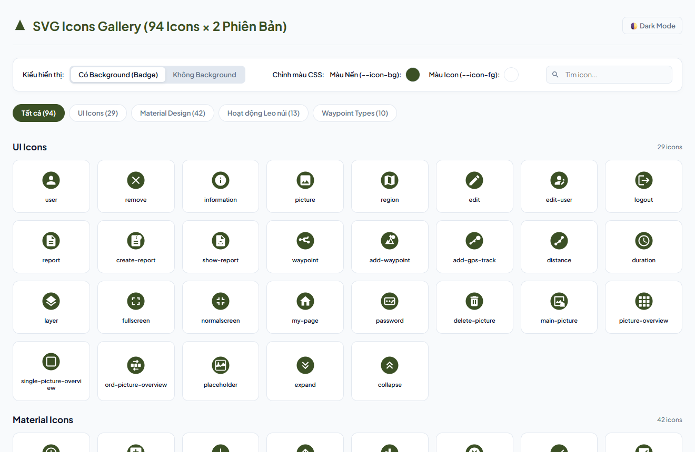
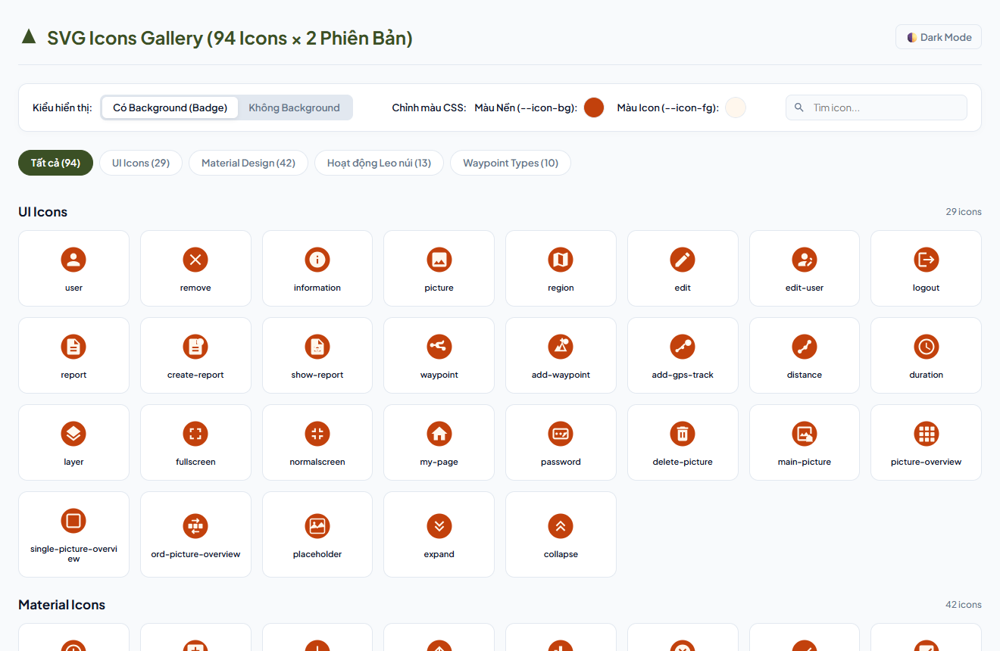
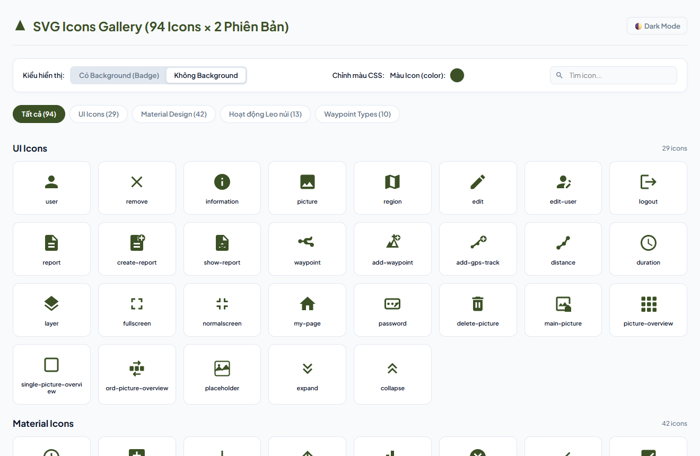
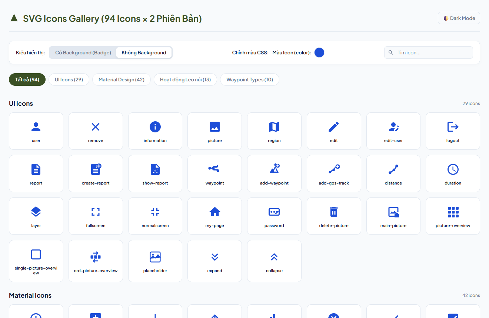
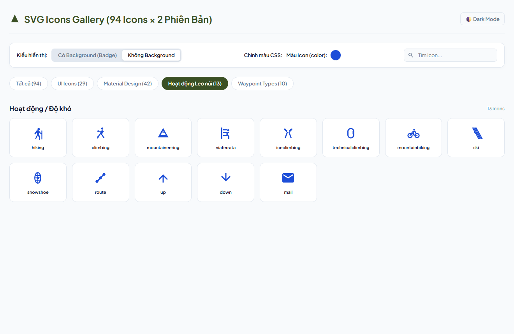
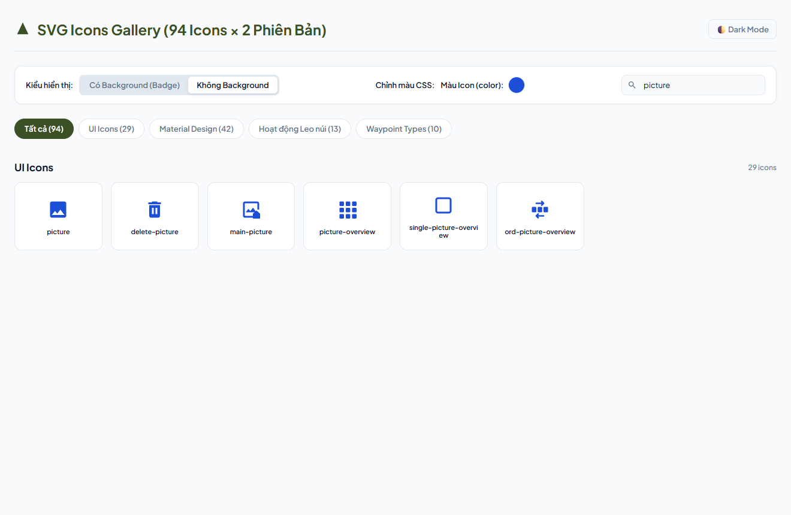
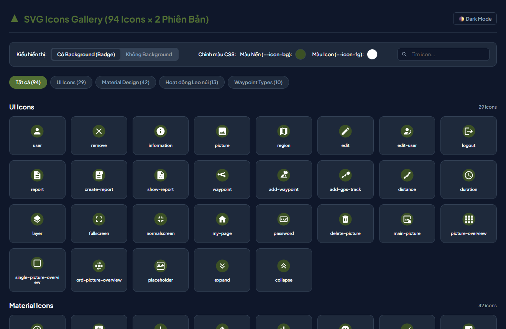

# Hiking Icons

Demo = https://quocchungthan.github.io/hiking-icons/

A set of **94 SVG icons** for hiking and outdoor apps. Each icon comes in two versions:

- **No background**: a single-color glyph that uses `currentColor`.
- **With background**: a round badge you can recolor with CSS variables (`--icon-bg`, `--icon-fg`).

Open [`index.html`](index.html) in a browser to browse, search and test the icons. The page is a single self-contained file, so it works straight from disk (`file:///…/index.html`).



## Icon categories

| Category | Folder | Count |
|---|---|---|
| UI Icons | `ui/` | 29 |
| Material Design | `material/` | 42 |
| Hiking activities / difficulty | `difficulty/` | 13 |
| Waypoint types | `waypointTypes/` | 10 |

## Project structure

```
index.html                    # Interactive gallery & CSS color tester
no-background/<category>/*.svg
with-background/<category>/*.svg
sprite-no-background.svg      # All no-bg icons as <symbol id="<category>-<name>">
sprite-with-background.svg    # All badge icons as <symbol id="<category>-<name>-bg">
docs/screenshots/             # Screenshots used in this README
.github/workflows/            # GitHub Pages deployment workflow
```

## Gallery features

### Badge mode with custom colors
Use the color pickers to change `--icon-bg` and `--icon-fg` live.



### No-background mode
Switch to **Không Background** to see the plain glyphs. The color picker sets the CSS `color` value.

| Default | Custom color |
|---|---|
|  |  |

### Category filter and search
Filter by category tab, or search by icon name.

| Category filter | Search |
|---|---|
|  |  |

### Dark mode and copy to clipboard
Toggle **🌓 Dark Mode** to preview icons on dark surfaces. Click any icon card to copy its SVG markup in the current mode.



## Usage

### Inline / file SVG (no background)
```html

<!-- or inline, the glyph follows the text color -->
<span style="color:#3b5025"><!-- paste SVG here --></span>
```

### Badge icon with CSS variables
```html
<style>
  .icon-with-bg { --icon-bg: #3b5025; --icon-fg: #ffffff; }
</style>
<!-- paste with-background/<category>/<name>.svg inline -->
```

### Sprite
```html
<!-- include the sprite file contents once in the page, then: -->
<svg width="24" height="24" style="color:#3b5025"><use href="#difficulty-hiking"></use></svg>
<svg width="24" height="24" style="--icon-bg:#3b5025;--icon-fg:#fff"><use href="#difficulty-hiking-bg"></use></svg>
```

## Deployment

[`.github/workflows/deploy-pages.yml`](.github/workflows/deploy-pages.yml) publishes the gallery to GitHub Pages on every push to `main`. It only works when Pages is enabled with **Settings → Pages → Source: GitHub Actions**, which requires repo admin permission.
